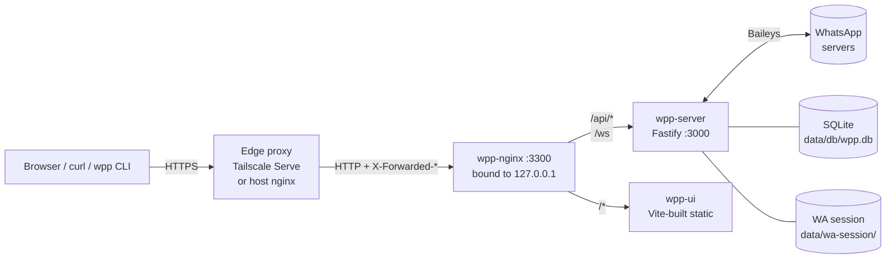

# WPP — WhatsApp Personal Proxy

> A self-hosted WhatsApp gateway for one person.
> Web UI, REST + WebSocket API, and CLI — all running in Docker, talking to
> WhatsApp through [Baileys](https://github.com/WhiskeySockets/Baileys).

WPP is a single-tenant tool for power users who want to:

- Drive their own WhatsApp account from scripts, automations, or a CLI
- Browse, search, and organize their chats in a fast keyboard-friendly UI
- Issue scoped API tokens to other tools (e.g. `personal:send` for a notifier,
  `channels:read` for a digest job) without handing over the whole account

It is **not** a multi-user SaaS, not a chatbot platform, and not affiliated
with WhatsApp or Meta.

> ⚠️ **WhatsApp ToS.** Baileys is an unofficial client. Using this may violate
> WhatsApp's Terms of Service and could result in your account being banned.
> Use at your own risk on a number you can afford to lose.

---

## Features

- **Web UI** — React/Tailwind workspace: tabbed channel list, search, message
  view, manual send, contact-name resolution across DMs and groups
- **REST API** — `/api/personal/send`, `/api/groups/send`, `/api/channels/*`,
  `/api/whitelist/*`, etc. — see scopes below
- **WebSocket** — live message stream with per-channel and per-tab subscriptions
- **CLI (`wpp`)** — Commander-based, reads `~/.wpp/config.yaml`, uses the same
  Bearer tokens as the API
- **SQLite** — single file, WAL mode, no external DB required
- **Media** — never auto-downloaded. Metadata is stored; files are fetched on
  explicit request only, then optionally saved to disk

---

## Architecture



| Service     | Stack                                    | Port (internal) |
|-------------|------------------------------------------|-----------------|
| `wpp-server`| Node 20, Fastify, Baileys, better-sqlite3| 3000            |
| `wpp-ui`    | React 18, Vite, Tailwind                 | 80 (built)      |
| `wpp-nginx` | nginx:alpine                             | 80 → host 3300  |

TLS is **never** terminated inside the stack. Run a real reverse proxy in
front (host nginx with Let's Encrypt, Tailscale Serve, Caddy, Cloudflare
Tunnel, …) and let it talk plain HTTP to `127.0.0.1:3300`. The Fastify
server has `trustProxy: true`, so `X-Forwarded-Proto` flips secure cookies
on automatically when the public URL is HTTPS.

---

## Quick start

```bash
git clone https://github.com/<you>/whatsapp-personal-proxy.git
cd whatsapp-personal-proxy

make init                           # creates data/, copies .env.example → .env

# Edit .env and set:
#   ADMIN_PASS  — anything but "changeme"
#   JWT_SECRET  — openssl rand -hex 32
#   PERSONAL_NUMBERS — your own E.164 numbers, comma-separated
#   PUBLIC_URL  — how you'll reach the UI (http://localhost:3300 is fine to start)

make up                             # docker compose up -d --build
```

Then open `http://localhost:3300`, log in with `ADMIN_USER`/`ADMIN_PASS`, and
scan the QR code with WhatsApp on your phone.

The server **refuses to start** if you leave `ADMIN_PASS=changeme` or the
default `JWT_SECRET` placeholder.

---

## Putting it on the internet (safely-ish)

Pick **one** of these — don't expose `:3300` directly.

### Option A — Tailscale (easiest)

```bash
# On the host running WPP:
tailscale serve --bg --https=443 http://127.0.0.1:3300
```

Tailscale gives you `https://your-host.tail-xxxx.ts.net` with a real cert.
Set `PUBLIC_URL` in `.env` to that URL and restart (`make up`).

### Option B — Host nginx with Let's Encrypt

Point a hostname at your box, get a cert (certbot, acme.sh), and proxy:

```nginx
server {
  listen 443 ssl http2;
  server_name wpp.example.com;
  ssl_certificate     /etc/letsencrypt/live/wpp.example.com/fullchain.pem;
  ssl_certificate_key /etc/letsencrypt/live/wpp.example.com/privkey.pem;

  location / {
    proxy_pass http://127.0.0.1:3300;
    proxy_http_version 1.1;
    proxy_set_header Host              $host;
    proxy_set_header X-Real-IP         $remote_addr;
    proxy_set_header X-Forwarded-For   $proxy_add_x_forwarded_for;
    proxy_set_header X-Forwarded-Proto $scheme;
    proxy_set_header Upgrade           $http_upgrade;
    proxy_set_header Connection        "upgrade";
    proxy_read_timeout 3600s;
  }
}
```

Set `PUBLIC_URL=https://wpp.example.com` in `.env`.

### Option C — LAN only (no TLS)

Set `BIND_HOST=0.0.0.0` in `.env` and `make up`. Only do this on a network you
trust; cookies will not be marked `Secure`.

---

## Configuration

All knobs live in `.env`. See [`.env.example`](.env.example) for the full
annotated list. The important ones:

| Variable          | Purpose                                                 |
|-------------------|---------------------------------------------------------|
| `ADMIN_USER` / `ADMIN_PASS` | Web UI login                                  |
| `JWT_SECRET`      | Session signing secret (≥32 chars)                      |
| `PERSONAL_NUMBERS`| E.164 numbers that bypass the whitelist                 |
| `PUBLIC_URL`      | How the UI/CLI is reached publicly                      |
| `COOKIE_SECURE`   | Force `Secure` cookie flag (auto from `PUBLIC_URL` if unset) |
| `BIND_HOST`       | What the container nginx binds to (default `127.0.0.1`) |
| `RATE_LIMIT_LOGIN`| Login attempts per minute per IP (`0` to disable)       |
| `RATE_LIMIT_SEND` | Send calls per minute per IP                            |

---

## API tokens & scopes

Generate tokens from the **Tokens** page in the UI. Each token gets one or
more scopes; the API rejects calls outside the granted scopes.

| Scope                       | What it unlocks                                          |
|-----------------------------|----------------------------------------------------------|
| `personal:send`             | Send messages to your own `PERSONAL_NUMBERS`             |
| `others:send`               | Send to whitelisted JIDs                                 |
| `others:whitelist:read`     | List the whitelist                                       |
| `others:whitelist:manage`   | Add/remove from the whitelist                            |
| `groups:send`               | Send messages to groups you're in                        |
| `channels:read`             | List channels and read messages/history                  |
| `channels:summarize`        | (Reserved for the LLM-summary endpoint)                  |
| `tabs:manage`               | Create/rename/delete tabs                                |
| `wa:admin`                  | Force-reconnect, refresh QR (used by `wpp` CLI)          |

Tokens are SHA-256 hashed at rest and shown to you exactly once at creation.

```bash
curl -H "Authorization: Bearer sk_..." \
     -H "Content-Type: application/json" \
     -d '{"to":"+15555550100","message":"hi"}' \
     https://wpp.example.com/api/personal/send
```

---

## Development

```bash
make dev    # docker compose up --build (foreground, hot reload)
make logs   # tail logs
make down   # stop everything (data persists in ./data/)
```

The `docker-compose.override.yml` mounts source for hot reload on the server
and Vite dev server on the UI.

### Pre-push checks

There's a `.githooks/pre-push` script that runs syntax checks, `npm audit`
(high+), lock-file integrity, a UI build, and a secret-sweep before every
push. Enable it once per clone:

```bash
git config core.hooksPath .githooks
```

The same checks (plus a `docker compose build` smoke test) run in CI on push,
PRs, and weekly via `.github/workflows/security-audit.yml`.

---

## Data layout

Everything lives under `./data/` on the host (bind-mounted into containers):

```
data/
├── db/wpp.db            SQLite database (messages, channels, tokens, …)
├── wa-session/          Baileys multi-file auth state — full WA credentials
└── media/               On-demand-saved media files (only when explicitly fetched)
```

**Treat `data/wa-session/` as a credential.** Anyone with that directory can
impersonate your WhatsApp account on a fresh install.

---

## Security

See [SECURITY.md](SECURITY.md) for the threat model, hardening notes, and how
to report vulnerabilities.

---

## License

[MIT](LICENSE) © 2026 Muhammad Ahsan Amin

This project is not affiliated with, endorsed by, or connected to WhatsApp,
Meta, or the Baileys maintainers.
