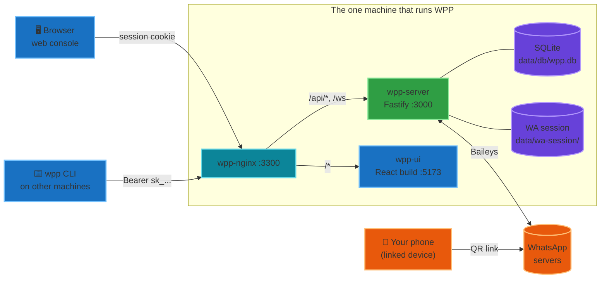

# Architecture

WPP is a single-tenant gateway: one WhatsApp account, one server, many client machines.



## Services

| Service | Stack | Listens |
|---|---|---|
| `wpp-server` | Node 20, Fastify, Baileys, better-sqlite3 | 3000 (container) |
| `wpp-ui` | React 18, Vite, Tailwind | 5173 (container) |
| `wpp-nginx` | nginx:alpine | 80 → host `${BIND_HOST}:3300` |

The UI container listens on **5173 in both development and production** — Vite's dev
port in dev, an nginx `listen 5173` in the built image — so `nginx/nginx.conf` has one
upstream that is correct either way.

## Request paths

- `/api/*` → nginx strips `/api` → Fastify. A route declared as `/channels` is public at `/api/channels`.
- `/ws` → Fastify WebSocket, used by the web console.
- `/*` → the UI container.

TLS is never terminated inside the stack. Put a real reverse proxy in front (host nginx,
Tailscale Serve, Caddy, Cloudflare Tunnel) and let it speak plain HTTP to the container.
Fastify runs with `trustProxy: true`, so `X-Forwarded-Proto` flips the secure-cookie flag
when the public URL is HTTPS.

## Two credentials, two audiences

The web console and the API are deliberately separate. The console holds a session cookie
and can do everything, including linking WhatsApp and minting tokens. Every other machine
holds a `sk_` bearer token limited to explicit scopes, so a notifier that only needs
`personal:send` cannot read your messages.

Tokens are SHA-256 hashed at rest. The plaintext is shown once, at creation.

## The WhatsApp link

Baileys speaks the WhatsApp multi-device protocol as a linked device — the same thing
WhatsApp Web is. Credentials live in `data/wa-session/` as Baileys' multi-file auth state.
**That directory is a credential**: anyone holding it can impersonate the account.

Linking happens only in the web console. The server emits QR codes on an event bus; the
console polls `/api/auth/wa/status` and renders them. A QR expires after roughly 20
seconds, so the status endpoint nulls anything older than 25 to avoid showing a dead code.

On a successful connection the server syncs every participating group into
`channel_meta`, so groups are searchable by name straight away.

## LID / PN duality

This is the one WhatsApp quirk worth understanding before reading the code.

Multi-device gives the same person two addresses: a phone-number JID
(`971501234567@s.whatsapp.net`, "PN") and a device-linked one (`8837...@lid`, "LID").
Chats often arrive under the LID while contact names arrive under the PN — so without
cross-referencing them, chats show up nameless and half a DM goes missing.

The `lid_map` table holds the correspondence, populated from contact events, chat
objects, `lid-mapping.update`, and message keys (`remoteJidAlt` / `participantAlt`).
Two things depend on it:

- **Names** propagate in both directions when a mapping is learned (`wa/client.js`).
- **Reads** expand one JID into every JID for the same conversation
  (`db/lidmap.js`), so `GET /api/channels/971501234567@s.whatsapp.net/messages`
  returns the whole thread regardless of which address the sender used.

## Storage

Everything is under `./data/` on the host, bind-mounted into the containers:

```
data/
├── db/wpp.db        SQLite (messages, channel_meta, tokens, whitelist, tabs, lid_map)
├── wa-session/      Baileys auth state — treat as a credential
└── media/           Only files explicitly saved
```

SQLite runs in WAL mode so reads do not block while Baileys is writing.

## Media policy

Media is never downloaded automatically. Messages store the mime type, size, sha256, and
the encrypted media key; the bytes are fetched from WhatsApp only when a caller asks for
that specific message, and written to disk only via the explicit `.../media/save` route.
This keeps the disk footprint of a busy account near zero.

## Event flow

Baileys events land on a Node `EventEmitter` that the server decorates onto Fastify. Two
transports fan it out:

- `/ws` — WebSocket, with per-chat and per-tab subscriptions. Used by the console.
- `/api/events` — Server-Sent Events. Used by `wpp watch`, because SSE needs nothing
  beyond Python's standard library.
